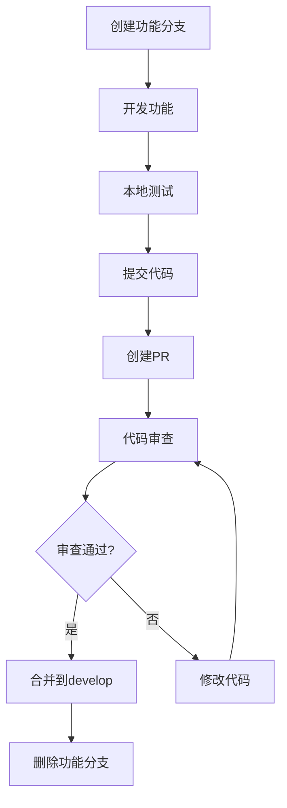
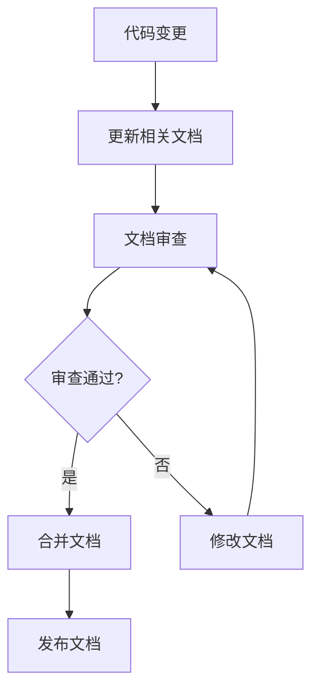

# 档案管理系统 - 项目结构与开发流程文档

## 1. 文档概述

### 1.1 文档目的
本文档详细描述档案管理系统的项目结构、开发流程、代码规范、测试策略、部署流程等，为开发团队提供统一的开发标准和工作流程指导。

### 1.2 适用范围
- 前端开发团队
- 后端开发团队
- 测试团队
- 运维团队
- 项目管理团队

### 1.3 文档维护
- **创建人**：系统架构师
- **维护人**：技术负责人
- **更新频率**：每个迭代周期更新
- **版本控制**：Git版本管理

## 2. 项目整体结构

### 2.1 项目架构图
```
档案管理系统
├── 前端应用 (Vue.js)
│   ├── 用户界面层
│   ├── 业务逻辑层
│   └── 数据访问层
├── 后端服务 (Spring Boot)
│   ├── 控制器层
│   ├── 服务层
│   ├── 数据访问层
│   └── 基础设施层
├── 数据库 (MySQL + Redis)
│   ├── 主数据库
│   ├── 缓存数据库
│   └── 文件存储
└── 基础设施
    ├── 容器化部署
    ├── 监控系统
    └── 日志系统
```

### 2.2 技术栈总览
```yaml
前端技术栈:
  - 框架: Vue.js 3.4+
  - 构建工具: Vite 5.0+
  - UI库: Element Plus 2.4+
  - 状态管理: Pinia 2.1+
  - 路由: Vue Router 4.2+
  - HTTP客户端: Axios 1.6+
  - 类型检查: TypeScript 5.0+

后端技术栈:
  - 框架: Spring Boot 3.2+
  - 数据库: MySQL 8.0+
  - 缓存: Redis 7.0+
  - 安全: Spring Security 6.0+
  - 文档: Swagger 3.0+
  - 消息队列: RabbitMQ 3.12+

基础设施:
  - 容器化: Docker 24.0+
  - 编排: Docker Compose
  - 反向代理: Nginx 1.24+
  - 监控: Prometheus + Grafana
  - 日志: ELK Stack
```

## 3. 前端项目结构

### 3.1 目录结构详解
```
archive-management-frontend/
├── .vscode/                    # VS Code配置
│   ├── extensions.json        # 推荐插件
│   ├── settings.json          # 工作区设置
│   └── launch.json            # 调试配置
├── public/                     # 静态资源
│   ├── favicon.ico
│   ├── logo.png
│   └── index.html
├── src/                        # 源代码
│   ├── api/                   # API接口
│   │   ├── modules/           # 按模块分组
│   │   │   ├── auth.ts        # 认证相关
│   │   │   ├── user.ts        # 用户管理
│   │   │   ├── archive.ts     # 档案管理
│   │   │   ├── borrow.ts      # 借阅管理
│   │   │   ├── category.ts    # 分类管理
│   │   │   ├── report.ts      # 报表统计
│   │   │   └── system.ts      # 系统管理
│   │   ├── request.ts         # Axios配置
│   │   ├── interceptors.ts    # 请求拦截器
│   │   └── types.ts           # API类型定义
│   ├── assets/                # 静态资源
│   │   ├── images/           # 图片资源
│   │   │   ├── logo/         # Logo相关
│   │   │   ├── icons/        # 图标
│   │   │   └── backgrounds/  # 背景图
│   │   ├── fonts/            # 字体文件
│   │   └── styles/           # 全局样式
│   │       ├── index.scss    # 样式入口
│   │       ├── variables.scss # 变量定义
│   │       ├── mixins.scss   # 混入定义
│   │       ├── reset.scss    # 样式重置
│   │       ├── common.scss   # 通用样式
│   │       └── themes/       # 主题样式
│   │           ├── default.scss
│   │           └── dark.scss
│   ├── components/            # 组件
│   │   ├── common/           # 通用组件
│   │   │   ├── AppHeader/    # 应用头部
│   │   │   │   ├── index.vue
│   │   │   │   ├── UserMenu.vue
│   │   │   │   └── NotificationCenter.vue
│   │   │   ├── AppSidebar/   # 侧边栏
│   │   │   │   ├── index.vue
│   │   │   │   ├── MenuItem.vue
│   │   │   │   └── MenuGroup.vue
│   │   │   ├── AppFooter/    # 页脚
│   │   │   ├── Breadcrumb/   # 面包屑
│   │   │   └── PageHeader/   # 页面头部
│   │   ├── business/         # 业务组件
│   │   │   ├── ArchiveCard/  # 档案卡片
│   │   │   ├── ArchiveList/  # 档案列表
│   │   │   ├── ArchiveForm/  # 档案表单
│   │   │   ├── UserSelector/ # 用户选择器
│   │   │   ├── FileUploader/ # 文件上传
│   │   │   ├── BorrowRecord/ # 借阅记录
│   │   │   └── AuditLog/     # 审计日志
│   │   └── ui/               # UI组件
│   │       ├── Dialog/       # 对话框
│   │       ├── Table/        # 表格
│   │       ├── Form/         # 表单
│   │       ├── Chart/        # 图表
│   │       └── Loading/      # 加载组件
│   ├── composables/          # 组合式函数
│   │   ├── useAuth.ts        # 认证相关
│   │   ├── usePermission.ts  # 权限控制
│   │   ├── useTable.ts       # 表格操作
│   │   ├── useForm.ts        # 表单处理
│   │   ├── useDialog.ts      # 对话框
│   │   ├── useRequest.ts     # 请求处理
│   │   └── useWebSocket.ts   # WebSocket
│   ├── directives/           # 自定义指令
│   │   ├── permission.ts     # 权限指令
│   │   ├── loading.ts        # 加载指令
│   │   ├── debounce.ts       # 防抖指令
│   │   └── clickOutside.ts   # 点击外部指令
│   ├── hooks/                # 自定义钩子
│   │   ├── useLocalStorage.ts
│   │   ├── useSessionStorage.ts
│   │   ├── useEventListener.ts
│   │   └── useResizeObserver.ts
│   ├── layouts/              # 布局组件
│   │   ├── DefaultLayout.vue # 默认布局
│   │   ├── AuthLayout.vue    # 认证布局
│   │   ├── BlankLayout.vue   # 空白布局
│   │   └── components/       # 布局子组件
│   │       ├── Header.vue
│   │       ├── Sidebar.vue
│   │       └── Footer.vue
│   ├── pages/                # 页面组件
│   │   ├── auth/             # 认证页面
│   │   │   ├── Login.vue     # 登录页
│   │   │   ├── Register.vue  # 注册页
│   │   │   └── ForgotPassword.vue # 忘记密码
│   │   ├── dashboard/        # 仪表板
│   │   │   ├── Index.vue     # 首页
│   │   │   ├── Statistics.vue # 统计概览
│   │   │   └── QuickActions.vue # 快捷操作
│   │   ├── archive/          # 档案管理
│   │   │   ├── List.vue      # 档案列表
│   │   │   ├── Detail.vue    # 档案详情
│   │   │   ├── Create.vue    # 创建档案
│   │   │   ├── Edit.vue      # 编辑档案
│   │   │   └── History.vue   # 档案历史
│   │   ├── borrow/           # 借阅管理
│   │   │   ├── List.vue      # 借阅列表
│   │   │   ├── Apply.vue     # 申请借阅
│   │   │   ├── Approve.vue   # 审批借阅
│   │   │   └── Return.vue    # 归还档案
│   │   ├── category/         # 分类管理
│   │   │   ├── List.vue      # 分类列表
│   │   │   └── Manage.vue    # 分类管理
│   │   ├── report/           # 报表统计
│   │   │   ├── Overview.vue  # 概览报表
│   │   │   ├── Archive.vue   # 档案报表
│   │   │   └── Borrow.vue    # 借阅报表
│   │   ├── system/           # 系统管理
│   │   │   ├── User.vue      # 用户管理
│   │   │   ├── Role.vue      # 角色管理
│   │   │   ├── Permission.vue # 权限管理
│   │   │   ├── Config.vue    # 系统配置
│   │   │   └── Log.vue       # 系统日志
│   │   └── error/            # 错误页面
│   │       ├── 403.vue       # 无权限
│   │       ├── 404.vue       # 页面不存在
│   │       └── 500.vue       # 服务器错误
│   ├── plugins/              # 插件配置
│   │   ├── element-plus.ts   # Element Plus配置
│   │   ├── axios.ts          # Axios配置
│   │   └── dayjs.ts          # 日期处理
│   ├── router/               # 路由配置
│   │   ├── index.ts          # 路由入口
│   │   ├── routes.ts         # 路由定义
│   │   ├── guards.ts         # 路由守卫
│   │   └── modules/          # 路由模块
│   │       ├── auth.ts
│   │       ├── archive.ts
│   │       └── system.ts
│   ├── stores/               # 状态管理
│   │   ├── index.ts          # Store入口
│   │   └── modules/          # Store模块
│   │       ├── auth.ts       # 认证状态
│   │       ├── user.ts       # 用户状态
│   │       ├── app.ts        # 应用状态
│   │       ├── permission.ts # 权限状态
│   │       └── settings.ts   # 设置状态
│   ├── types/                # 类型定义
│   │   ├── api.ts            # API类型
│   │   ├── common.ts         # 通用类型
│   │   ├── business.ts       # 业务类型
│   │   ├── auth.ts           # 认证类型
│   │   └── global.d.ts       # 全局类型声明
│   ├── utils/                # 工具函数
│   │   ├── auth.ts           # 认证工具
│   │   ├── format.ts         # 格式化工具
│   │   ├── validate.ts       # 验证工具
│   │   ├── constants.ts      # 常量定义
│   │   ├── storage.ts        # 存储工具
│   │   ├── download.ts       # 下载工具
│   │   └── permission.ts     # 权限工具
│   ├── App.vue               # 根组件
│   └── main.ts               # 应用入口
├── tests/                     # 测试文件
│   ├── unit/                 # 单元测试
│   │   ├── components/       # 组件测试
│   │   ├── utils/            # 工具函数测试
│   │   └── stores/           # 状态管理测试
│   ├── e2e/                  # 端到端测试
│   │   ├── auth.spec.ts      # 认证流程测试
│   │   ├── archive.spec.ts   # 档案管理测试
│   │   └── borrow.spec.ts    # 借阅流程测试
│   └── fixtures/             # 测试数据
│       ├── users.json
│       └── archives.json
├── docs/                      # 文档
│   ├── README.md             # 项目说明
│   ├── CHANGELOG.md          # 更新日志
│   ├── CONTRIBUTING.md       # 贡献指南
│   └── deployment.md         # 部署文档
├── .env.example              # 环境变量示例
├── .env.development          # 开发环境变量
├── .env.production           # 生产环境变量
├── .gitignore                # Git忽略文件
├── .eslintrc.js              # ESLint配置
├── .prettierrc               # Prettier配置
├── tsconfig.json             # TypeScript配置
├── vite.config.ts            # Vite配置
├── package.json              # 项目依赖
└── pnpm-lock.yaml            # 依赖锁定文件
```

### 3.2 配置文件说明

#### 3.2.1 Vite配置
```typescript
// vite.config.ts
import { defineConfig } from 'vite'
import vue from '@vitejs/plugin-vue'
import { resolve } from 'path'

export default defineConfig({
  plugins: [vue()],
  resolve: {
    alias: {
      '@': resolve(__dirname, 'src'),
      '@components': resolve(__dirname, 'src/components'),
      '@pages': resolve(__dirname, 'src/pages'),
      '@utils': resolve(__dirname, 'src/utils'),
      '@api': resolve(__dirname, 'src/api'),
      '@stores': resolve(__dirname, 'src/stores'),
      '@types': resolve(__dirname, 'src/types')
    }
  },
  server: {
    port: 3000,
    proxy: {
      '/api': {
        target: 'http://localhost:8080',
        changeOrigin: true,
        rewrite: (path) => path.replace(/^\/api/, '')
      }
    }
  },
  build: {
    outDir: 'dist',
    rollupOptions: {
      output: {
        manualChunks: {
          vendor: ['vue', 'vue-router', 'pinia'],
          element: ['element-plus'],
          utils: ['axios', 'dayjs', 'lodash-es']
        }
      }
    }
  }
})
```

#### 3.2.2 TypeScript配置
```json
{
  "compilerOptions": {
    "target": "ES2020",
    "useDefineForClassFields": true,
    "lib": ["ES2020", "DOM", "DOM.Iterable"],
    "module": "ESNext",
    "skipLibCheck": true,
    "moduleResolution": "bundler",
    "allowImportingTsExtensions": true,
    "resolveJsonModule": true,
    "isolatedModules": true,
    "noEmit": true,
    "jsx": "preserve",
    "strict": true,
    "noUnusedLocals": true,
    "noUnusedParameters": true,
    "noFallthroughCasesInSwitch": true,
    "baseUrl": ".",
    "paths": {
      "@/*": ["src/*"],
      "@components/*": ["src/components/*"],
      "@pages/*": ["src/pages/*"],
      "@utils/*": ["src/utils/*"],
      "@api/*": ["src/api/*"],
      "@stores/*": ["src/stores/*"],
      "@types/*": ["src/types/*"]
    }
  },
  "include": ["src/**/*.ts", "src/**/*.d.ts", "src/**/*.tsx", "src/**/*.vue"],
  "references": [{ "path": "./tsconfig.node.json" }]
}
```

## 4. 后端项目结构

### 4.1 目录结构详解
```
archive-management-backend/
├── src/
│   └── main/
│       ├── java/
│       │   └── com/
│       │       └── company/
│       │           └── archive/
│       │               ├── ArchiveApplication.java # 启动类
│       │               ├── config/              # 配置类
│       │               │   ├── SecurityConfig.java
│       │               │   ├── WebConfig.java
│       │               │   ├── DatabaseConfig.java
│       │               │   ├── RedisConfig.java
│       │               │   └── SwaggerConfig.java
│       │               ├── controller/          # 控制器层
│       │               │   ├── auth/           # 认证控制器
│       │               │   │   ├── AuthController.java
│       │               │   │   └── UserController.java
│       │               │   ├── archive/        # 档案控制器
│       │               │   │   ├── ArchiveController.java
│       │               │   │   ├── CategoryController.java
│       │               │   │   └── FileController.java
│       │               │   ├── borrow/         # 借阅控制器
│       │               │   │   ├── BorrowController.java
│       │               │   │   └── ApprovalController.java
│       │               │   ├── system/         # 系统控制器
│       │               │   │   ├── RoleController.java
│       │               │   │   ├── PermissionController.java
│       │               │   │   └── ConfigController.java
│       │               │   └── report/         # 报表控制器
│       │               │       └── ReportController.java
│       │               ├── service/            # 服务层
│       │               │   ├── auth/           # 认证服务
│       │               │   │   ├── AuthService.java
│       │               │   │   ├── UserService.java
│       │               │   │   └── TokenService.java
│       │               │   ├── archive/        # 档案服务
│       │               │   │   ├── ArchiveService.java
│       │               │   │   ├── CategoryService.java
│       │               │   │   └── FileService.java
│       │               │   ├── borrow/         # 借阅服务
│       │               │   │   ├── BorrowService.java
│       │               │   │   └── ApprovalService.java
│       │               │   ├── system/         # 系统服务
│       │               │   │   ├── RoleService.java
│       │               │   │   ├── PermissionService.java
│       │               │   │   └── ConfigService.java
│       │               │   └── report/         # 报表服务
│       │               │       └── ReportService.java
│       │               ├── repository/         # 数据访问层
│       │               │   ├── auth/           # 认证相关
│       │               │   │   ├── UserRepository.java
│       │               │   │   └── RoleRepository.java
│       │               │   ├── archive/        # 档案相关
│       │               │   │   ├── ArchiveRepository.java
│       │               │   │   ├── CategoryRepository.java
│       │               │   │   └── FileRepository.java
│       │               │   ├── borrow/         # 借阅相关
│       │               │   │   ├── BorrowRepository.java
│       │               │   │   └── ApprovalRepository.java
│       │               │   └── system/         # 系统相关
│       │               │       ├── PermissionRepository.java
│       │               │       └── ConfigRepository.java
│       │               ├── entity/             # 实体类
│       │               │   ├── auth/           # 认证实体
│       │               │   │   ├── User.java
│       │               │   │   ├── Role.java
│       │               │   │   └── Permission.java
│       │               │   ├── archive/        # 档案实体
│       │               │   │   ├── Archive.java
│       │               │   │   ├── Category.java
│       │               │   │   ├── ArchiveFile.java
│       │               │   │   └── ArchiveHistory.java
│       │               │   ├── borrow/         # 借阅实体
│       │               │   │   ├── BorrowRecord.java
│       │               │   │   └── ApprovalRecord.java
│       │               │   └── system/         # 系统实体
│       │               │       ├── SystemConfig.java
│       │               │       └── AuditLog.java
│       │               ├── dto/                # 数据传输对象
│       │               │   ├── request/        # 请求DTO
│       │               │   │   ├── auth/
│       │               │   │   ├── archive/
│       │               │   │   └── borrow/
│       │               │   └── response/       # 响应DTO
│       │               │       ├── auth/
│       │               │       ├── archive/
│       │               │       └── borrow/
│       │               ├── common/             # 通用组件
│       │               │   ├── annotation/    # 自定义注解
│       │               │   │   ├── RequirePermission.java
│       │               │   │   └── AuditLog.java
│       │               │   ├── aspect/         # 切面
│       │               │   │   ├── PermissionAspect.java
│       │               │   │   └── AuditLogAspect.java
│       │               │   ├── exception/     # 异常处理
│       │               │   │   ├── GlobalExceptionHandler.java
│       │               │   │   ├── BusinessException.java
│       │               │   │   └── ErrorCode.java
│       │               │   ├── filter/        # 过滤器
│       │               │   │   ├── JwtAuthenticationFilter.java
│       │               │   │   └── RequestLoggingFilter.java
│       │               │   ├── interceptor/   # 拦截器
│       │               │   │   └── PermissionInterceptor.java
│       │               │   ├── validator/     # 验证器
│       │               │   │   ├── PhoneValidator.java
│       │               │   │   └── EmailValidator.java
│       │               │   └── util/          # 工具类
│       │               │       ├── JwtUtil.java
│       │               │       ├── PasswordUtil.java
│       │               │       ├── FileUtil.java
│       │               │       └── DateUtil.java
│       │               └── constant/          # 常量定义
│       │                   ├── SecurityConstants.java
│       │                   ├── BusinessConstants.java
│       │                   └── SystemConstants.java
│       └── resources/
│           ├── application.yml              # 主配置文件
│           ├── application-dev.yml          # 开发环境配置
│           ├── application-prod.yml         # 生产环境配置
│           ├── mapper/                      # MyBatis映射文件
│           │   ├── auth/
│           │   ├── archive/
│           │   └── borrow/
│           ├── db/                          # 数据库脚本
│           │   ├── migration/               # 数据库迁移脚本
│           │   │   ├── V1__init_tables.sql
│           │   │   ├── V2__add_indexes.sql
│           │   │   └── V3__insert_data.sql
│           │   └── data/                    # 初始化数据
│           │       ├── roles.sql
│           │       └── permissions.sql
│           ├── static/                      # 静态资源
│           └── templates/                   # 模板文件
├── docs/                                    # 文档
│   ├── api/                                # API文档
│   │   └── swagger.yaml
│   ├── database/                           # 数据库文档
│   │   └── schema.md
│   └── deployment/                         # 部署文档
│       └── docker.md
├── scripts/                                # 脚本文件
│   ├── build.sh                           # 构建脚本
│   ├── deploy.sh                          # 部署脚本
│   └── backup.sh                          # 备份脚本
├── docker/                                 # Docker配置
│   ├── Dockerfile                         # Docker镜像构建
│   ├── docker-compose.yml                 # 容器编排
│   └── nginx/                             # Nginx配置
│       └── nginx.conf
├── .gitignore                             # Git忽略文件
├── pom.xml                                # Maven配置
└── README.md                              # 项目说明
```

### 4.2 Maven配置
```xml
<?xml version="1.0" encoding="UTF-8"?>
<project xmlns="http://maven.apache.org/POM/4.0.0">
    <modelVersion>4.0.0</modelVersion>
    
    <parent>
        <groupId>org.springframework.boot</groupId>
        <artifactId>spring-boot-starter-parent</artifactId>
        <version>3.2.1</version>
        <relativePath/>
    </parent>
    
    <groupId>com.company</groupId>
    <artifactId>archive-management</artifactId>
    <version>1.0.0</version>
    <packaging>jar</packaging>
    
    <properties>
        <java.version>17</java.version>
        <maven.compiler.source>17</maven.compiler.source>
        <maven.compiler.target>17</maven.compiler.target>
        <project.build.sourceEncoding>UTF-8</project.build.sourceEncoding>
    </properties>
    
    <dependencies>
        <!-- Spring Boot Starters -->
        <dependency>
            <groupId>org.springframework.boot</groupId>
            <artifactId>spring-boot-starter-web</artifactId>
        </dependency>
        <dependency>
            <groupId>org.springframework.boot</groupId>
            <artifactId>spring-boot-starter-data-jpa</artifactId>
        </dependency>
        <dependency>
            <groupId>org.springframework.boot</groupId>
            <artifactId>spring-boot-starter-security</artifactId>
        </dependency>
        <dependency>
            <groupId>org.springframework.boot</groupId>
            <artifactId>spring-boot-starter-validation</artifactId>
        </dependency>
        <dependency>
            <groupId>org.springframework.boot</groupId>
            <artifactId>spring-boot-starter-data-redis</artifactId>
        </dependency>
        
        <!-- Database -->
        <dependency>
            <groupId>mysql</groupId>
            <artifactId>mysql-connector-java</artifactId>
        </dependency>
        
        <!-- JWT -->
        <dependency>
            <groupId>io.jsonwebtoken</groupId>
            <artifactId>jjwt-api</artifactId>
            <version>0.11.5</version>
        </dependency>
        
        <!-- Swagger -->
        <dependency>
            <groupId>org.springdoc</groupId>
            <artifactId>springdoc-openapi-starter-webmvc-ui</artifactId>
            <version>2.2.0</version>
        </dependency>
        
        <!-- Test -->
        <dependency>
            <groupId>org.springframework.boot</groupId>
            <artifactId>spring-boot-starter-test</artifactId>
            <scope>test</scope>
        </dependency>
    </dependencies>
    
    <build>
        <plugins>
            <plugin>
                <groupId>org.springframework.boot</groupId>
                <artifactId>spring-boot-maven-plugin</artifactId>
            </plugin>
        </plugins>
    </build>
</project>
```

## 5. 开发流程规范

### 5.1 Git工作流

#### 5.1.1 分支策略
```
主分支:
├── main                    # 生产环境分支
├── develop                 # 开发环境分支
├── release/v1.0.0         # 发布分支
├── hotfix/fix-login-bug   # 热修复分支
└── feature/               # 功能分支
    ├── archive-management
    ├── user-authentication
    └── borrow-workflow
```

#### 5.1.2 分支命名规范
```bash
# 功能分支
feature/功能名称
feature/archive-management
feature/user-authentication

# 修复分支
bugfix/问题描述
bugfix/fix-login-error
bugfix/resolve-file-upload

# 热修复分支
hotfix/紧急修复描述
hotfix/fix-security-vulnerability

# 发布分支
release/版本号
release/v1.0.0
release/v1.1.0
```

#### 5.1.3 提交信息规范
```bash
# 提交信息格式
<type>(<scope>): <subject>

<body>

<footer>

# 类型说明
feat:     新功能
fix:      修复bug
docs:     文档更新
style:    代码格式调整
refactor: 代码重构
test:     测试相关
chore:    构建过程或辅助工具的变动

# 示例
feat(auth): 添加用户登录功能

- 实现用户名密码登录
- 添加JWT token生成
- 集成Spring Security

Closes #123
```

### 5.2 开发环境搭建

#### 5.2.1 前端环境
```bash
# 1. 克隆项目
git clone https://github.com/company/archive-management-frontend.git
cd archive-management-frontend

# 2. 安装依赖
pnpm install

# 3. 启动开发服务器
pnpm dev

# 4. 构建生产版本
pnpm build

# 5. 运行测试
pnpm test

# 6. 代码检查
pnpm lint
pnpm lint:fix
```

#### 5.2.2 后端环境
```bash
# 1. 克隆项目
git clone https://github.com/company/archive-management-backend.git
cd archive-management-backend

# 2. 配置数据库
# 创建数据库
mysql -u root -p
CREATE DATABASE archive_management;

# 3. 配置环境变量
cp src/main/resources/application-dev.yml.example src/main/resources/application-dev.yml
# 编辑配置文件，设置数据库连接信息

# 4. 启动应用
./mvnw spring-boot:run

# 5. 运行测试
./mvnw test

# 6. 构建项目
./mvnw clean package
```

### 5.3 代码审查流程

#### 5.3.1 Pull Request流程


#### 5.3.2 代码审查清单
```markdown
## 代码审查清单

### 功能性
- [ ] 功能是否按需求正确实现
- [ ] 边界条件是否正确处理
- [ ] 错误处理是否完善
- [ ] 性能是否满足要求

### 代码质量
- [ ] 代码是否遵循项目规范
- [ ] 变量和函数命名是否清晰
- [ ] 代码是否有适当的注释
- [ ] 是否存在重复代码

### 安全性
- [ ] 是否存在安全漏洞
- [ ] 输入验证是否充分
- [ ] 权限控制是否正确
- [ ] 敏感信息是否泄露

### 测试
- [ ] 是否包含单元测试
- [ ] 测试覆盖率是否达标
- [ ] 集成测试是否通过
- [ ] 手动测试是否完成
```

### 5.4 持续集成/持续部署

#### 5.4.1 CI/CD流程
```yaml
# .github/workflows/ci.yml
name: CI/CD Pipeline

on:
  push:
    branches: [ main, develop ]
  pull_request:
    branches: [ main, develop ]

jobs:
  frontend-test:
    runs-on: ubuntu-latest
    steps:
      - uses: actions/checkout@v3
      - uses: actions/setup-node@v3
        with:
          node-version: '18'
      - run: npm ci
      - run: npm run lint
      - run: npm run test
      - run: npm run build

  backend-test:
    runs-on: ubuntu-latest
    steps:
      - uses: actions/checkout@v3
      - uses: actions/setup-java@v3
        with:
          java-version: '17'
      - run: ./mvnw clean test
      - run: ./mvnw clean package

  deploy:
    needs: [frontend-test, backend-test]
    runs-on: ubuntu-latest
    if: github.ref == 'refs/heads/main'
    steps:
      - uses: actions/checkout@v3
      - name: Deploy to production
        run: |
          # 部署脚本
          ./scripts/deploy.sh
```

## 6. 测试策略

### 6.1 测试金字塔
```
    /\
   /  \     E2E Tests (10%)
  /____\    
 /      \   Integration Tests (20%)
/________\  Unit Tests (70%)
```

### 6.2 前端测试

#### 6.2.1 单元测试
```typescript
// tests/unit/components/ArchiveCard.test.ts
import { mount } from '@vue/test-utils'
import { describe, it, expect } from 'vitest'
import ArchiveCard from '@/components/business/ArchiveCard.vue'

describe('ArchiveCard', () => {
  const mockArchive = {
    id: 1,
    title: '测试档案',
    archiveNo: 'DA-2025-000001',
    categoryName: '人事档案',
    securityLevel: 1,
    submitTime: '2025-01-20T10:30:00Z'
  }

  it('应该正确渲染档案信息', () => {
    const wrapper = mount(ArchiveCard, {
      props: { archive: mockArchive }
    })

    expect(wrapper.find('.archive-card__title').text()).toBe('测试档案')
    expect(wrapper.text()).toContain('DA-2025-000001')
    expect(wrapper.text()).toContain('人事档案')
  })

  it('应该在点击查看按钮时触发事件', async () => {
    const wrapper = mount(ArchiveCard, {
      props: { archive: mockArchive }
    })

    await wrapper.find('[data-testid="view-btn"]').trigger('click')

    expect(wrapper.emitted('view')).toBeTruthy()
    expect(wrapper.emitted('view')?.[0]).toEqual([mockArchive])
  })
})
```

#### 6.2.2 集成测试
```typescript
// tests/integration/auth.test.ts
import { describe, it, expect, beforeEach } from 'vitest'
import { createPinia, setActivePinia } from 'pinia'
import { useAuthStore } from '@/stores/modules/auth'

describe('认证流程集成测试', () => {
  beforeEach(() => {
    setActivePinia(createPinia())
  })

  it('应该能够完成登录流程', async () => {
    const authStore = useAuthStore()
    
    const loginData = {
      username: 'admin',
      password: '123456'
    }

    await authStore.login(loginData)

    expect(authStore.isAuthenticated).toBe(true)
    expect(authStore.user).toBeTruthy()
    expect(localStorage.getItem('token')).toBeTruthy()
  })
})
```

### 6.3 后端测试

#### 6.3.1 单元测试
```java
// src/test/java/com/company/archive/service/ArchiveServiceTest.java
@ExtendWith(MockitoExtension.class)
class ArchiveServiceTest {

    @Mock
    private ArchiveRepository archiveRepository;

    @InjectMocks
    private ArchiveService archiveService;

    @Test
    void shouldCreateArchiveSuccessfully() {
        // Given
        ArchiveCreateRequest request = new ArchiveCreateRequest();
        request.setTitle("测试档案");
        request.setCategoryId(1L);

        Archive savedArchive = new Archive();
        savedArchive.setId(1L);
        savedArchive.setTitle("测试档案");

        when(archiveRepository.save(any(Archive.class))).thenReturn(savedArchive);

        // When
        ArchiveResponse response = archiveService.createArchive(request);

        // Then
        assertThat(response.getId()).isEqualTo(1L);
        assertThat(response.getTitle()).isEqualTo("测试档案");
        verify(archiveRepository).save(any(Archive.class));
    }
}
```

#### 6.3.2 集成测试
```java
// src/test/java/com/company/archive/controller/ArchiveControllerIntegrationTest.java
@SpringBootTest(webEnvironment = SpringBootTest.WebEnvironment.RANDOM_PORT)
@AutoConfigureTestDatabase(replace = AutoConfigureTestDatabase.Replace.NONE)
@Testcontainers
class ArchiveControllerIntegrationTest {

    @Container
    static MySQLContainer<?> mysql = new MySQLContainer<>("mysql:8.0")
            .withDatabaseName("test_archive")
            .withUsername("test")
            .withPassword("test");

    @Autowired
    private TestRestTemplate restTemplate;

    @Test
    void shouldCreateArchiveSuccessfully() {
        // Given
        ArchiveCreateRequest request = new ArchiveCreateRequest();
        request.setTitle("集成测试档案");
        request.setCategoryId(1L);

        // When
        ResponseEntity<ArchiveResponse> response = restTemplate.postForEntity(
                "/api/v1/archives", request, ArchiveResponse.class);

        // Then
        assertThat(response.getStatusCode()).isEqualTo(HttpStatus.CREATED);
        assertThat(response.getBody().getTitle()).isEqualTo("集成测试档案");
    }
}
```

## 7. 部署流程

### 7.1 Docker容器化

#### 7.1.1 前端Dockerfile
```dockerfile
# 前端Dockerfile
FROM node:18-alpine AS builder

WORKDIR /app
COPY package*.json ./
RUN npm ci --only=production

COPY . .
RUN npm run build

FROM nginx:alpine
COPY --from=builder /app/dist /usr/share/nginx/html
COPY docker/nginx/nginx.conf /etc/nginx/nginx.conf

EXPOSE 80
CMD ["nginx", "-g", "daemon off;"]
```

#### 7.1.2 后端Dockerfile
```dockerfile
# 后端Dockerfile
FROM openjdk:17-jdk-slim AS builder

WORKDIR /app
COPY mvnw .
COPY .mvn .mvn
COPY pom.xml .
RUN ./mvnw dependency:go-offline

COPY src src
RUN ./mvnw clean package -DskipTests

FROM openjdk:17-jre-slim
WORKDIR /app
COPY --from=builder /app/target/*.jar app.jar

EXPOSE 8080
ENTRYPOINT ["java", "-jar", "app.jar"]
```

#### 7.1.3 Docker Compose
```yaml
# docker-compose.yml
version: '3.8'

services:
  mysql:
    image: mysql:8.0
    environment:
      MYSQL_ROOT_PASSWORD: root123
      MYSQL_DATABASE: archive_management
      MYSQL_USER: archive
      MYSQL_PASSWORD: archive123
    ports:
      - "3306:3306"
    volumes:
      - mysql_data:/var/lib/mysql
      - ./docker/mysql/init.sql:/docker-entrypoint-initdb.d/init.sql

  redis:
    image: redis:7-alpine
    ports:
      - "6379:6379"
    volumes:
      - redis_data:/data

  backend:
    build:
      context: ./backend
      dockerfile: Dockerfile
    ports:
      - "8080:8080"
    environment:
      SPRING_PROFILES_ACTIVE: docker
      SPRING_DATASOURCE_URL: jdbc:mysql://mysql:3306/archive_management
      SPRING_REDIS_HOST: redis
    depends_on:
      - mysql
      - redis

  frontend:
    build:
      context: ./frontend
      dockerfile: Dockerfile
    ports:
      - "80:80"
    depends_on:
      - backend

volumes:
  mysql_data:
  redis_data:
```

### 7.2 部署脚本

#### 7.2.1 自动化部署脚本
```bash
#!/bin/bash
# scripts/deploy.sh

set -e

echo "开始部署档案管理系统..."

# 1. 拉取最新代码
git pull origin main

# 2. 构建前端
echo "构建前端应用..."
cd frontend
npm ci
npm run build
cd ..

# 3. 构建后端
echo "构建后端应用..."
cd backend
./mvnw clean package -DskipTests
cd ..

# 4. 停止现有服务
echo "停止现有服务..."
docker-compose down

# 5. 构建新镜像
echo "构建Docker镜像..."
docker-compose build

# 6. 启动服务
echo "启动服务..."
docker-compose up -d

# 7. 等待服务启动
echo "等待服务启动..."
sleep 30

# 8. 健康检查
echo "执行健康检查..."
curl -f http://localhost:8080/actuator/health || exit 1
curl -f http://localhost/ || exit 1

echo "部署完成！"
```

### 7.3 监控和日志

#### 7.3.1 应用监控
```yaml
# docker-compose.monitoring.yml
version: '3.8'

services:
  prometheus:
    image: prom/prometheus
    ports:
      - "9090:9090"
    volumes:
      - ./monitoring/prometheus.yml:/etc/prometheus/prometheus.yml

  grafana:
    image: grafana/grafana
    ports:
      - "3000:3000"
    environment:
      GF_SECURITY_ADMIN_PASSWORD: admin
    volumes:
      - grafana_data:/var/lib/grafana

  elasticsearch:
    image: docker.elastic.co/elasticsearch/elasticsearch:8.5.0
    environment:
      - discovery.type=single-node
      - xpack.security.enabled=false
    ports:
      - "9200:9200"

  kibana:
    image: docker.elastic.co/kibana/kibana:8.5.0
    ports:
      - "5601:5601"
    environment:
      ELASTICSEARCH_HOSTS: http://elasticsearch:9200

volumes:
  grafana_data:
```

## 8. 质量保证

### 8.1 代码质量检查

#### 8.1.1 SonarQube集成
```yaml
# sonar-project.properties
sonar.projectKey=archive-management
sonar.projectName=Archive Management System
sonar.projectVersion=1.0

sonar.sources=src/main
sonar.tests=src/test
sonar.java.binaries=target/classes
sonar.junit.reportPaths=target/surefire-reports
sonar.jacoco.reportPaths=target/jacoco.exec

sonar.coverage.exclusions=**/*Config.java,**/*Application.java
```

#### 8.1.2 代码覆盖率要求
```xml
<!-- pom.xml中的JaCoCo配置 -->
<plugin>
    <groupId>org.jacoco</groupId>
    <artifactId>jacoco-maven-plugin</artifactId>
    <version>0.8.8</version>
    <executions>
        <execution>
            <goals>
                <goal>prepare-agent</goal>
            </goals>
        </execution>
        <execution>
            <id>report</id>
            <phase>test</phase>
            <goals>
                <goal>report</goal>
            </goals>
        </execution>
        <execution>
            <id>check</id>
            <goals>
                <goal>check</goal>
            </goals>
            <configuration>
                <rules>
                    <rule>
                        <element>BUNDLE</element>
                        <limits>
                            <limit>
                                <counter>LINE</counter>
                                <value>COVEREDRATIO</value>
                                <minimum>0.80</minimum>
                            </limit>
                        </limits>
                    </rule>
                </rules>
            </configuration>
        </execution>
    </executions>
</plugin>
```

### 8.2 性能测试

#### 8.2.1 JMeter测试计划
```xml
<!-- 档案管理系统性能测试计划 -->
<?xml version="1.0" encoding="UTF-8"?>
<jmeterTestPlan version="1.2">
  <hashTree>
    <TestPlan guiclass="TestPlanGui" testclass="TestPlan" testname="档案管理系统性能测试">
      <elementProp name="TestPlan.arguments" elementType="Arguments" guiclass="ArgumentsPanel">
        <collectionProp name="Arguments.arguments"/>
      </elementProp>
      <stringProp name="TestPlan.user_define_classpath"></stringProp>
      <boolProp name="TestPlan.functional_mode">false</boolProp>
      <boolProp name="TestPlan.serialize_threadgroups">false</boolProp>
    </TestPlan>
    
    <!-- 线程组配置 -->
    <ThreadGroup guiclass="ThreadGroupGui" testclass="ThreadGroup" testname="用户并发测试">
      <stringProp name="ThreadGroup.on_sample_error">continue</stringProp>
      <elementProp name="ThreadGroup.main_controller" elementType="LoopController">
        <boolProp name="LoopController.continue_forever">false</boolProp>
        <stringProp name="LoopController.loops">10</stringProp>
      </elementProp>
      <stringProp name="ThreadGroup.num_threads">100</stringProp>
      <stringProp name="ThreadGroup.ramp_time">60</stringProp>
    </ThreadGroup>
  </hashTree>
</jmeterTestPlan>
```

## 9. 安全规范

### 9.1 代码安全

#### 9.1.1 安全检查清单
```markdown
## 安全检查清单

### 认证和授权
- [ ] 密码强度验证
- [ ] JWT token安全配置
- [ ] 会话管理
- [ ] 权限控制

### 输入验证
- [ ] SQL注入防护
- [ ] XSS攻击防护
- [ ] CSRF攻击防护
- [ ] 文件上传安全

### 数据保护
- [ ] 敏感数据加密
- [ ] 数据传输加密
- [ ] 日志脱敏
- [ ] 备份安全

### 系统安全
- [ ] 依赖漏洞扫描
- [ ] 安全头配置
- [ ] 错误信息处理
- [ ] 访问日志记录
```

### 9.2 依赖安全扫描
```bash
# 前端依赖扫描
npm audit
npm audit fix

# 后端依赖扫描
./mvnw org.owasp:dependency-check-maven:check
```

## 10. 文档管理

### 10.1 文档结构
```
docs/
├── README.md                   # 项目概述
├── CHANGELOG.md               # 更新日志
├── CONTRIBUTING.md            # 贡献指南
├── architecture/              # 架构文档
│   ├── system-design.md
│   ├── database-design.md
│   └── api-specification.md
├── development/               # 开发文档
│   ├── setup-guide.md
│   ├── coding-standards.md
│   └── testing-guide.md
├── deployment/                # 部署文档
│   ├── docker-guide.md
│   ├── production-setup.md
│   └── monitoring-guide.md
└── user/                      # 用户文档
    ├── user-manual.md
    ├── admin-guide.md
    └── troubleshooting.md
```

### 10.2 文档维护流程


---

**文档版本**：v1.0  
**创建日期**：2025年1月  
**更新日期**：2025年1月  
**文档状态**：待评审