# 档案管理系统 - 业务流程详细设计文档

## 1. 文档概述

### 1.1 文档目的
本文档详细描述档案管理系统的核心业务流程、状态机设计、工作流程规范等，为开发团队提供业务逻辑实现的详细指导，确保系统能够准确反映实际业务需求。

### 1.2 适用范围
- 业务分析师
- 系统架构师
- 开发团队
- 测试团队
- 产品经理

### 1.3 业务流程概览
档案管理系统主要包含以下核心业务流程：
- 用户认证与权限管理流程
- 档案归档管理流程
- 档案借阅管理流程
- 档案销毁管理流程
- 审批工作流程
- 统计报表生成流程

## 2. 用户认证与权限管理流程

### 2.1 用户登录流程
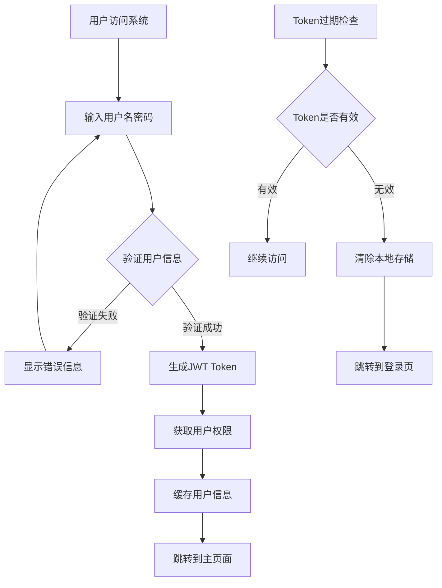

### 2.2 权限验证流程
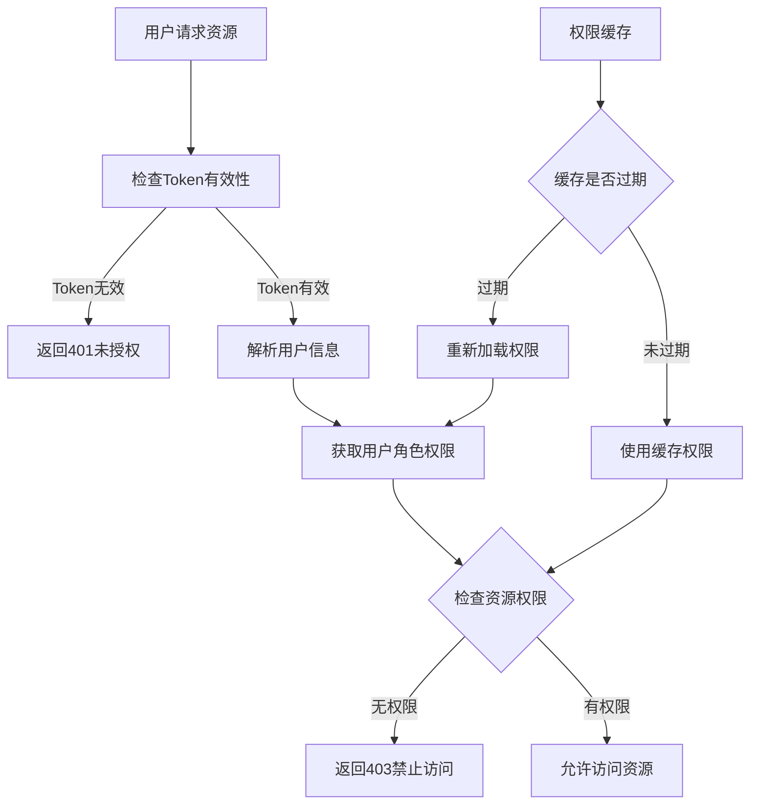

### 2.3 用户状态机设计
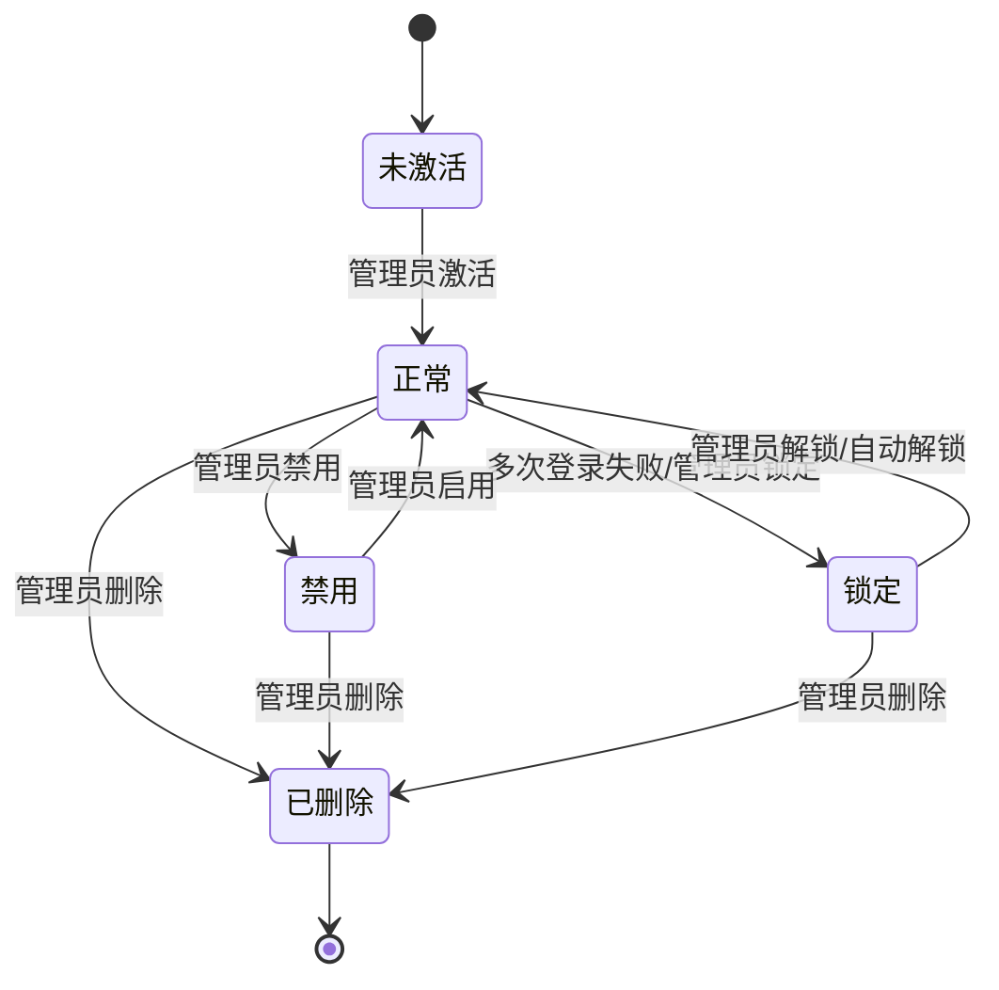

## 3. 档案归档管理流程

### 3.1 档案创建流程
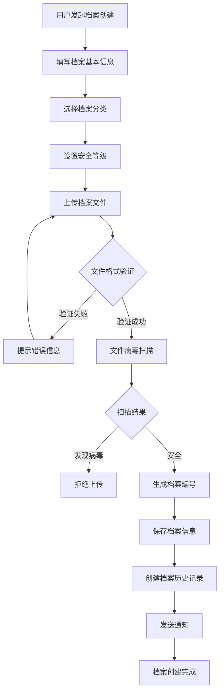

### 3.2 档案审核流程
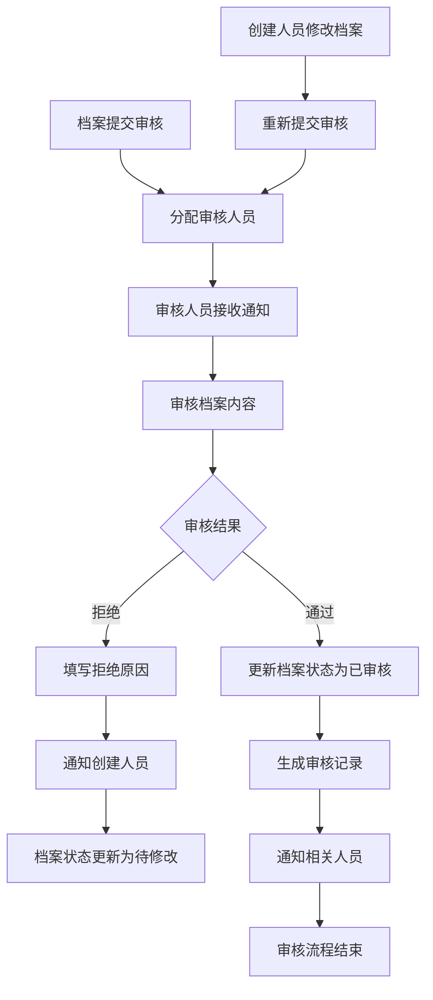

### 3.3 档案状态机设计
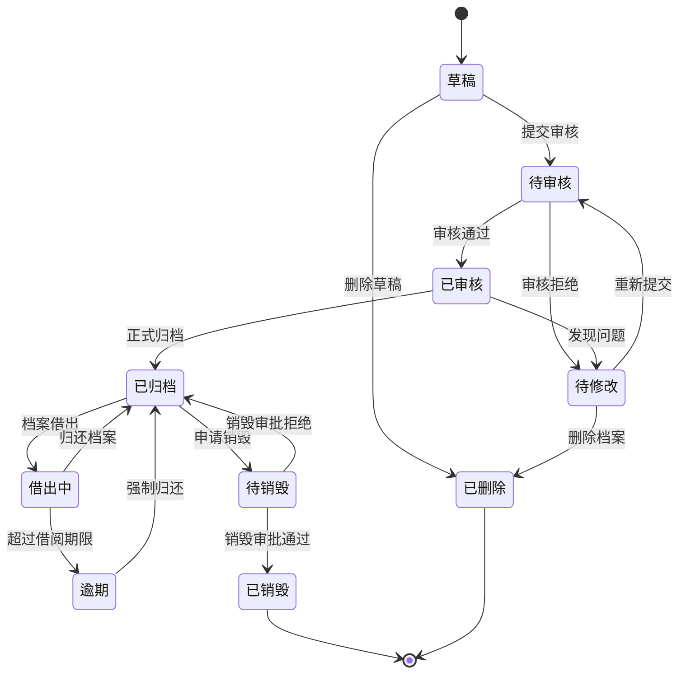

## 4. 档案借阅管理流程

### 4.1 借阅申请流程
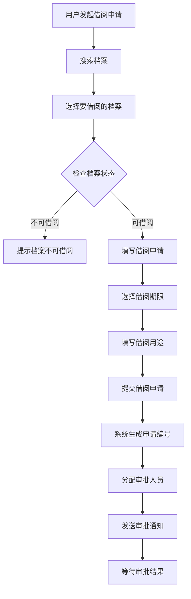

### 4.2 借阅审批流程
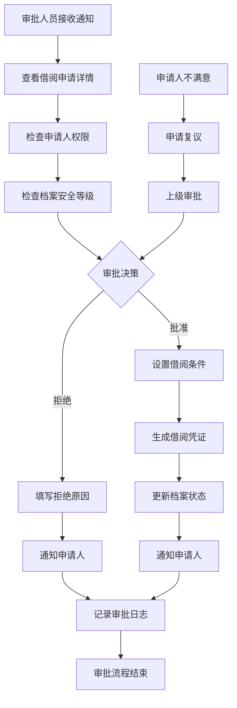

### 4.3 借阅状态机设计
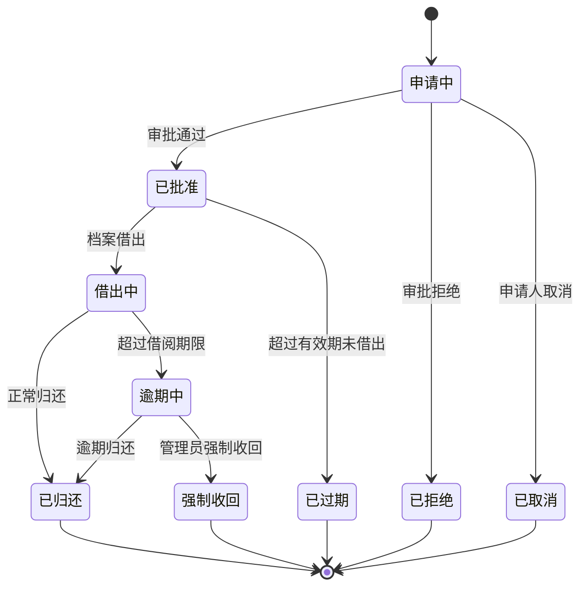

### 4.4 借阅归还流程
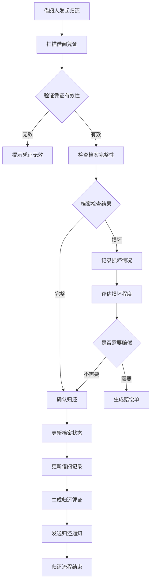

## 5. 档案销毁管理流程

### 5.1 销毁申请流程
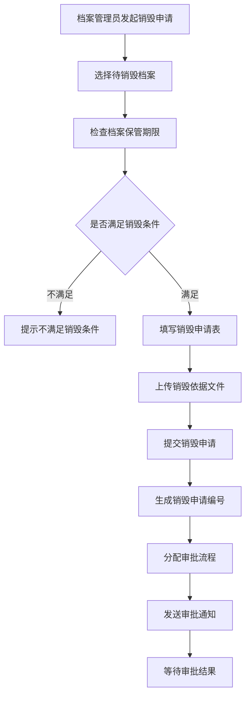

### 5.2 销毁审批流程
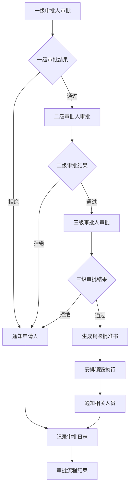

### 5.3 销毁执行流程
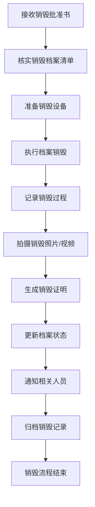

## 6. 审批工作流程设计

### 6.1 通用审批流程引擎
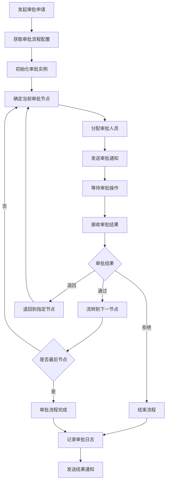

### 6.2 审批节点配置
```yaml
# 借阅审批流程配置示例
borrow_approval_workflow:
  name: "档案借阅审批流程"
  version: "1.0"
  nodes:
    - id: "start"
      name: "开始节点"
      type: "start"
      next: "dept_manager_approval"
    
    - id: "dept_manager_approval"
      name: "部门经理审批"
      type: "approval"
      approver_type: "role"
      approver_value: "DEPT_MANAGER"
      timeout: 72  # 72小时超时
      actions:
        - approve: "archive_manager_approval"
        - reject: "end"
        - return: "start"
    
    - id: "archive_manager_approval"
      name: "档案管理员审批"
      type: "approval"
      approver_type: "role"
      approver_value: "ARCHIVE_MANAGER"
      timeout: 48
      condition: "security_level >= 3"  # 安全等级3级以上需要
      actions:
        - approve: "end"
        - reject: "end"
        - return: "dept_manager_approval"
    
    - id: "end"
      name: "结束节点"
      type: "end"
```

### 6.3 审批状态机
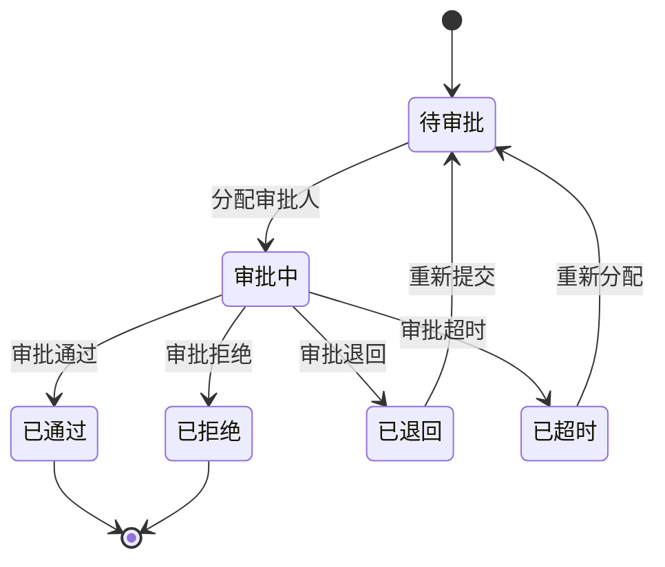

## 7. 统计报表生成流程

### 7.1 报表生成流程
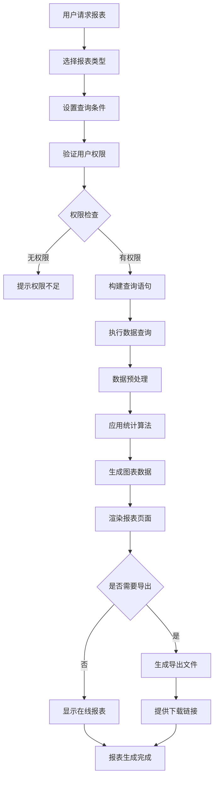

### 7.2 定时报表任务流程
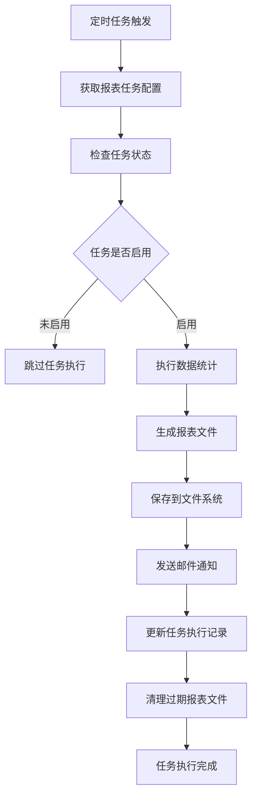

## 8. 系统集成流程

### 8.1 外部系统集成流程
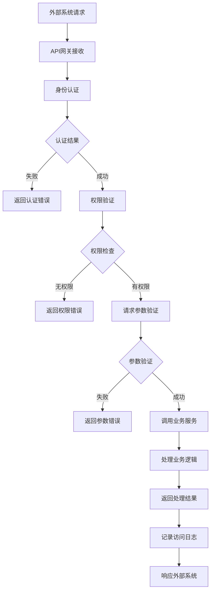

### 8.2 数据同步流程
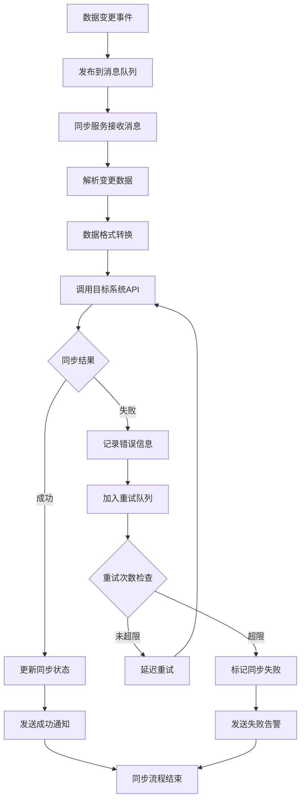

## 9. 异常处理流程

### 9.1 系统异常处理流程
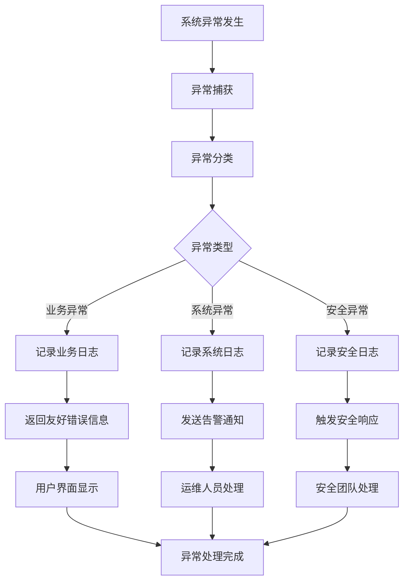

### 9.2 数据恢复流程
```mermaid
graph TD
    A[数据异常检测] --> B[评估影响范围]
    B --> C[确定恢复策略]
    C --> D{恢复类型}
    D -->|增量恢复| E[从备份恢复增量数据]
    D -->|全量恢复| F[从备份恢复全量数据]
    D -->|实时恢复| G[从日志恢复数据]
    E --> H[验证数据完整性]
    F --> H
    G --> H
    H --> I{验证结果}
    I -->|成功| J[切换到恢复数据]
    I -->|失败| K[尝试其他恢复方式]
    K --> C
    J --> L[通知相关人员]
    L --> M[恢复流程完成]
```

## 10. 性能优化流程

### 10.1 查询优化流程
```mermaid
graph TD
    A[检测慢查询] --> B[分析查询语句]
    B --> C[检查索引使用]
    C --> D{索引优化}
    D -->|需要优化| E[创建或调整索引]
    D -->|索引正常| F[检查查询逻辑]
    E --> G[测试查询性能]
    F --> H[优化查询语句]
    H --> G
    G --> I{性能是否改善}
    I -->|是| J[部署优化方案]
    I -->|否| K[考虑其他优化方式]
    K --> L[数据分区]
    L --> M[缓存策略]
    M --> G
    J --> N[监控性能指标]
    N --> O[优化流程完成]
```

### 10.2 缓存更新流程
```mermaid
graph TD
    A[数据更新事件] --> B[识别相关缓存]
    B --> C{缓存更新策略}
    C -->|立即更新| D[同步更新缓存]
    C -->|延迟更新| E[标记缓存过期]
    C -->|删除缓存| F[清除相关缓存]
    D --> G[验证缓存一致性]
    E --> H[下次访问时更新]
    F --> I[下次访问时重建]
    G --> J{一致性检查}
    J -->|一致| K[缓存更新成功]
    J -->|不一致| L[重新更新缓存]
    L --> G
    H --> M[缓存更新完成]
    I --> M
    K --> M
```

## 11. 业务规则配置

### 11.1 档案分类规则
```yaml
# 档案分类业务规则
archive_classification_rules:
  - category: "人事档案"
    security_level: 3
    retention_period: 70  # 保管期限70年
    access_roles: ["HR_MANAGER", "ARCHIVE_MANAGER"]
    approval_workflow: "hr_approval_workflow"
    
  - category: "财务档案"
    security_level: 4
    retention_period: 30
    access_roles: ["FINANCE_MANAGER", "ARCHIVE_MANAGER"]
    approval_workflow: "finance_approval_workflow"
    
  - category: "技术档案"
    security_level: 2
    retention_period: 20
    access_roles: ["TECH_MANAGER", "ARCHIVE_MANAGER", "ENGINEER"]
    approval_workflow: "tech_approval_workflow"
```

### 11.2 借阅权限规则
```yaml
# 借阅权限业务规则
borrow_permission_rules:
  - security_level: 1
    max_borrow_days: 30
    max_concurrent_borrows: 10
    allowed_roles: ["ALL"]
    
  - security_level: 2
    max_borrow_days: 15
    max_concurrent_borrows: 5
    allowed_roles: ["MANAGER", "SENIOR_STAFF"]
    
  - security_level: 3
    max_borrow_days: 7
    max_concurrent_borrows: 3
    allowed_roles: ["MANAGER"]
    
  - security_level: 4
    max_borrow_days: 3
    max_concurrent_borrows: 1
    allowed_roles: ["SENIOR_MANAGER"]
```

## 12. 监控和告警流程

### 12.1 系统监控流程
```mermaid
graph TD
    A[系统运行] --> B[收集监控指标]
    B --> C[指标数据处理]
    C --> D[存储到监控数据库]
    D --> E[实时指标分析]
    E --> F{阈值检查}
    F -->|正常| G[继续监控]
    F -->|异常| H[触发告警]
    H --> I[发送告警通知]
    I --> J[记录告警日志]
    J --> K[等待处理确认]
    K --> L{问题是否解决}
    L -->|已解决| M[关闭告警]
    L -->|未解决| N[升级告警]
    N --> O[通知上级处理]
    M --> G
    O --> K
```

### 12.2 业务监控流程
```mermaid
graph TD
    A[业务操作执行] --> B[记录业务指标]
    B --> C[计算业务KPI]
    C --> D[更新监控面板]
    D --> E{业务指标检查}
    E -->|正常| F[继续业务监控]
    E -->|异常| G[生成业务告警]
    G --> H[分析异常原因]
    H --> I[通知业务负责人]
    I --> J[制定处理方案]
    J --> K[执行处理措施]
    K --> L[验证处理效果]
    L --> M{问题是否解决}
    M -->|是| N[关闭业务告警]
    M -->|否| O[调整处理方案]
    O --> K
    N --> F
```

---

**文档版本**：v1.0  
**创建日期**：2025年1月  
**更新日期**：2025年1月  
**文档状态**：待评审

## 附录

### A. 业务流程图例说明
- 矩形：处理步骤
- 菱形：判断节点
- 圆形：开始/结束节点
- 箭头：流程方向

### B. 状态机图例说明
- 圆角矩形：状态
- 箭头：状态转换
- 标签：转换条件

### C. 相关文档引用
- 《系统架构设计.md》
- 《数据库设计.md》
- 《API接口规范.md》
- 《项目结构与开发流程.md》