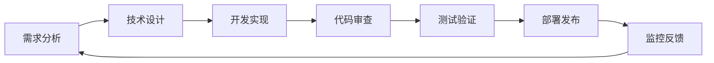

# 档案管理系统完善实施行动指南

## 目录
1. [第一阶段实施计划](#第一阶段实施计划)
2. [第二阶段实施计划](#第二阶段实施计划)
3. [第三阶段实施计划](#第三阶段实施计划)
4. [技术实施细节](#技术实施细节)
5. [质量保证流程](#质量保证流程)
6. [部署与运维](#部署与运维)
7. [成本分析与预算](#成本分析与预算)
8. [团队协作与项目管理](#团队协作与项目管理)
9. [变更管理流程](#变更管理流程)
10. [用户培训与接受度](#用户培训与接受度)
11. [性能基准测试](#性能基准测试)
12. [安全实施指南](#安全实施指南)

## 第一阶段实施计划

### 阶段目标
完成高优先级功能的开发，包括消息通知系统、移动端适配和基础报表功能。

### 时间安排：1-2个月

### 1.1 消息通知系统完善

#### 1.1.1 WebSocket实时通知实现

**开发任务**：
- [ ] 集成Spring WebSocket
- [ ] 实现消息推送服务
- [ ] 前端WebSocket客户端
- [ ] 消息持久化存储

**技术实现步骤**：

1. **后端WebSocket配置**
```java
// 1. 添加依赖到pom.xml
<dependency>
    <groupId>org.springframework.boot</groupId>
    <artifactId>spring-boot-starter-websocket</artifactId>
</dependency>

// 2. WebSocket配置类
@Configuration
@EnableWebSocket
public class WebSocketConfig implements WebSocketConfigurer {
    @Override
    public void registerWebSocketHandlers(WebSocketHandlerRegistry registry) {
        registry.addHandler(new NotificationWebSocketHandler(), "/ws/notifications")
                .setAllowedOrigins("*");
    }
}

// 3. 消息处理器
@Component
public class NotificationWebSocketHandler extends TextWebSocketHandler {
    // 实现消息推送逻辑
}
```

2. **前端WebSocket集成**
```typescript
// src/utils/websocket.ts
export class WebSocketService {
  private ws: WebSocket | null = null;
  
  connect() {
    this.ws = new WebSocket('ws://localhost:8080/ws/notifications');
    // 实现连接、消息处理、重连逻辑
  }
}
```

3. **消息中心界面开发**
```vue
<!-- src/views/MessageCenter.vue -->
<template>
  <div class="message-center">
    <!-- 消息列表、分类、搜索功能 -->
  </div>
</template>
```

**验收标准**：
- 实时消息推送延迟 < 100ms
- 支持消息分类和优先级
- 消息中心界面完整
- 支持消息已读/未读状态

#### 1.1.2 邮件通知模板系统

**开发任务**：
- [ ] 邮件模板引擎集成
- [ ] 模板管理界面
- [ ] 邮件发送队列
- [ ] 发送状态跟踪

**技术实现步骤**：

1. **邮件服务增强**
```java
@Service
public class EmailTemplateService {
    // Thymeleaf模板引擎
    // 模板管理
    // 批量发送
}
```

2. **模板管理界面**
```vue
<!-- src/views/EmailTemplates.vue -->
<template>
  <div class="email-templates">
    <!-- 模板编辑器、预览、测试发送 -->
  </div>
</template>
```

**验收标准**：
- 支持HTML邮件模板
- 模板变量替换功能
- 邮件发送成功率 > 95%
- 发送状态实时跟踪

### 1.2 移动端适配

#### 1.2.1 响应式设计优化

**开发任务**：
- [ ] CSS媒体查询优化
- [ ] 移动端组件适配
- [ ] 触摸手势支持
- [ ] 移动端导航优化

**技术实现步骤**：

1. **响应式布局调整**
```scss
// src/styles/responsive.scss
@media (max-width: 768px) {
  .main-layout {
    // 移动端布局样式
  }
}
```

2. **移动端组件库集成**
```bash
npm install vant @vant/touch-emulator
```

3. **移动端专用页面**
```vue
<!-- src/views/mobile/MobileArchive.vue -->
<template>
  <div class="mobile-archive">
    <!-- 移动端档案管理界面 -->
  </div>
</template>
```

**验收标准**：
- 支持主流移动设备分辨率
- 触摸操作流畅
- 移动端加载速度 < 3s
- 核心功能移动端可用

### 1.3 基础报表系统

#### 1.3.1 可视化报表组件

**开发任务**：
- [ ] 图表组件库集成
- [ ] 报表数据API
- [ ] 报表配置界面
- [ ] 导出功能实现

**技术实现步骤**：

1. **图表库集成**
```bash
npm install echarts vue-echarts
```

2. **报表服务开发**
```java
@RestController
@RequestMapping("/api/reports")
public class ReportController {
    // 统计数据API
    // 报表生成API
    // 导出API
}
```

3. **报表界面开发**
```vue
<!-- src/views/Reports.vue -->
<template>
  <div class="reports">
    <!-- 图表展示、筛选条件、导出功能 -->
  </div>
</template>
```

**验收标准**：
- 支持柱状图、饼图、折线图
- 数据实时更新
- 支持PDF/Excel导出
- 报表加载时间 < 2s

## 第二阶段实施计划

### 阶段目标
实现文档预览、智能化功能基础和系统集成准备。

### 时间安排：2-3个月

### 2.1 文档预览功能

#### 2.1.1 在线预览组件

**开发任务**：
- [ ] PDF预览组件
- [ ] Office文档预览
- [ ] 图片预览优化
- [ ] 预览权限控制

**技术实现步骤**：

1. **文档预览服务**
```java
@Service
public class DocumentPreviewService {
    // PDF转换
    // Office文档处理
    // 预览缓存管理
}
```

2. **前端预览组件**
```vue
<!-- src/components/DocumentPreview.vue -->
<template>
  <div class="document-preview">
    <!-- PDF.js集成、Office预览 -->
  </div>
</template>
```

**验收标准**：
- 支持PDF、Word、Excel、PPT预览
- 预览加载时间 < 5s
- 支持缩放、翻页操作
- 预览权限验证

### 2.2 智能化功能基础

#### 2.2.1 全文检索优化

**开发任务**：
- [ ] Elasticsearch集成
- [ ] 文档内容索引
- [ ] 智能搜索算法
- [ ] 搜索结果优化

**技术实现步骤**：

1. **Elasticsearch配置**
```yaml
# docker-compose.yml
elasticsearch:
  image: elasticsearch:8.8.0
  environment:
    - discovery.type=single-node
```

2. **搜索服务实现**
```java
@Service
public class ElasticsearchService {
    // 文档索引
    // 全文搜索
    // 结果排序
}
```

**验收标准**：
- 搜索响应时间 < 500ms
- 支持模糊搜索、高亮显示
- 搜索准确率 > 90%
- 支持搜索历史和建议

## 第三阶段实施计划

### 阶段目标
实现高级智能功能、企业级集成和用户体验优化。

### 时间安排：3-6个月

### 3.1 高级智能功能

#### 3.1.1 OCR文字识别

**开发任务**：
- [ ] OCR服务集成
- [ ] 图片文字提取
- [ ] 识别结果校验
- [ ] 批量处理支持

**技术实现步骤**：

1. **OCR服务集成**
```java
@Service
public class OcrService {
    // 百度OCR API集成
    // 腾讯云OCR集成
    // 识别结果处理
}
```

**验收标准**：
- 文字识别准确率 > 95%
- 支持中英文识别
- 批量处理能力
- 识别速度 < 3s/页

## 技术实施细节

### 开发环境准备

#### 环境要求
- JDK 17+
- Node.js 18+
- MySQL 8.0+
- Redis 6.0+
- Docker & Docker Compose

#### 开发工具
- IDE: IntelliJ IDEA / VS Code
- 版本控制: Git
- 构建工具: Maven / npm
- 测试工具: JUnit 5 / Vitest

### 代码规范

#### 后端代码规范
```java
// 1. 类命名：大驼峰命名法
public class NotificationService {
    
    // 2. 方法命名：小驼峰命名法
    public void sendNotification() {
        
    }
    
    // 3. 常量命名：全大写下划线分隔
    private static final String MESSAGE_TYPE_SYSTEM = "SYSTEM";
}
```

#### 前端代码规范
```typescript
// 1. 组件命名：大驼峰命名法
export default defineComponent({
  name: 'MessageCenter',
  
  // 2. 变量命名：小驼峰命名法
  setup() {
    const messageList = ref([]);
    
    // 3. 常量命名：全大写下划线分隔
    const MESSAGE_TYPES = {
      SYSTEM: 'system',
      EMAIL: 'email'
    };
  }
});
```

### 数据库变更管理

#### 版本控制策略
```sql
-- V1.1__add_notification_tables.sql
CREATE TABLE notification (
    id BIGINT PRIMARY KEY AUTO_INCREMENT,
    user_id BIGINT NOT NULL,
    title VARCHAR(200) NOT NULL,
    content TEXT,
    type VARCHAR(50) NOT NULL,
    status VARCHAR(20) DEFAULT 'UNREAD',
    created_at TIMESTAMP DEFAULT CURRENT_TIMESTAMP,
    updated_at TIMESTAMP DEFAULT CURRENT_TIMESTAMP ON UPDATE CURRENT_TIMESTAMP
);
```

## 质量保证流程

### 测试策略

#### 单元测试
```java
@ExtendWith(MockitoExtension.class)
class NotificationServiceTest {
    
    @Mock
    private NotificationRepository notificationRepository;
    
    @InjectMocks
    private NotificationService notificationService;
    
    @Test
    void shouldSendNotificationSuccessfully() {
        // 测试逻辑
    }
}
```

#### 集成测试
```java
@SpringBootTest
@AutoConfigureTestDatabase
class NotificationIntegrationTest {
    
    @Test
    void shouldSendEmailNotification() {
        // 集成测试逻辑
    }
}
```

#### 前端测试
```typescript
// tests/components/MessageCenter.test.ts
import { mount } from '@vue/test-utils';
import MessageCenter from '@/views/MessageCenter.vue';

describe('MessageCenter', () => {
  it('should render message list', () => {
    // 测试逻辑
  });
});
```

### 代码审查流程

#### Pull Request模板
```markdown
## 变更描述
- [ ] 新功能
- [ ] Bug修复
- [ ] 重构
- [ ] 文档更新

## 测试清单
- [ ] 单元测试通过
- [ ] 集成测试通过
- [ ] 手动测试完成

## 影响范围
- 影响的模块：
- 数据库变更：
- API变更：
```

### 性能监控

#### 关键指标监控
- 响应时间监控
- 错误率监控
- 系统资源监控
- 业务指标监控

#### 监控配置
```yaml
# prometheus.yml
scrape_configs:
  - job_name: 'archive-system'
    static_configs:
      - targets: ['localhost:8080']
```

## 部署与运维

### 部署流程

#### Docker部署
```dockerfile
# Dockerfile
FROM openjdk:17-jre-slim
COPY target/archive-system.jar app.jar
EXPOSE 8080
ENTRYPOINT ["java", "-jar", "/app.jar"]
```

#### Docker Compose配置
```yaml
# docker-compose.yml
version: '3.8'
services:
  app:
    build: .
    ports:
      - "8080:8080"
    depends_on:
      - mysql
      - redis
  
  mysql:
    image: mysql:8.0
    environment:
      MYSQL_ROOT_PASSWORD: password
      MYSQL_DATABASE: archive_system
  
  redis:
    image: redis:6.0-alpine
```

### 运维监控

#### 日志管理
```yaml
# logback-spring.xml
<configuration>
    <appender name="FILE" class="ch.qos.logback.core.rolling.RollingFileAppender">
        <file>logs/archive-system.log</file>
        <rollingPolicy class="ch.qos.logback.core.rolling.TimeBasedRollingPolicy">
            <fileNamePattern>logs/archive-system.%d{yyyy-MM-dd}.log</fileNamePattern>
            <maxHistory>30</maxHistory>
        </rollingPolicy>
    </appender>
</configuration>
```

#### 健康检查
```java
@Component
public class CustomHealthIndicator implements HealthIndicator {
    
    @Override
    public Health health() {
        // 自定义健康检查逻辑
        return Health.up()
                .withDetail("database", "available")
                .withDetail("redis", "available")
                .build();
    }
}
```

### 备份与恢复

#### 数据库备份脚本
```bash
#!/bin/bash
# backup.sh
DATE=$(date +%Y%m%d_%H%M%S)
mysqldump -u root -p archive_system > backup_${DATE}.sql
```

#### 自动化备份
```yaml
# crontab
0 2 * * * /path/to/backup.sh
```

## 风险控制

### 回滚策略
- 数据库变更回滚脚本
- 应用版本回滚机制
- 配置回滚方案

### 灰度发布
- 流量分流配置
- 功能开关控制
- 监控告警设置

### 应急预案
- 系统故障处理流程
- 数据恢复方案
- 紧急联系人清单

---

**文档版本**: v1.0  
**最后更新**: 2024年12月  
**维护人员**: 开发团队

## 成本分析与预算

### 7.1 人力成本分析

#### 第一阶段人力投入（1-2个月）
| 角色 | 人数 | 月薪（万元） | 工期（月） | 总成本（万元） |
|------|------|-------------|------------|---------------|
| 高级后端开发 | 2 | 2.5 | 2 | 10.0 |
| 高级前端开发 | 2 | 2.2 | 2 | 8.8 |
| UI/UX设计师 | 1 | 1.8 | 1.5 | 2.7 |
| 测试工程师 | 1 | 1.5 | 2 | 3.0 |
| 项目经理 | 1 | 2.0 | 2 | 4.0 |
| **第一阶段小计** | **7** | **-** | **-** | **28.5** |

#### 第二阶段人力投入（2-3个月）
| 角色 | 人数 | 月薪（万元） | 工期（月） | 总成本（万元） |
|------|------|-------------|------------|---------------|
| 高级后端开发 | 2 | 2.5 | 3 | 15.0 |
| 高级前端开发 | 2 | 2.2 | 3 | 13.2 |
| 算法工程师 | 1 | 3.0 | 2 | 6.0 |
| DevOps工程师 | 1 | 2.8 | 2 | 5.6 |
| 测试工程师 | 1 | 1.5 | 3 | 4.5 |
| 项目经理 | 1 | 2.0 | 3 | 6.0 |
| **第二阶段小计** | **8** | **-** | **-** | **50.3** |

#### 第三阶段人力投入（3-6个月）
| 角色 | 人数 | 月薪（万元） | 工期（月） | 总成本（万元） |
|------|------|-------------|------------|---------------|
| 高级后端开发 | 2 | 2.5 | 4 | 20.0 |
| 高级前端开发 | 1 | 2.2 | 4 | 8.8 |
| 算法工程师 | 1 | 3.0 | 4 | 12.0 |
| 系统架构师 | 1 | 4.0 | 3 | 12.0 |
| DevOps工程师 | 1 | 2.8 | 4 | 11.2 |
| 测试工程师 | 1 | 1.5 | 4 | 6.0 |
| 项目经理 | 1 | 2.0 | 4 | 8.0 |
| **第三阶段小计** | **8** | **-** | **-** | **78.0** |

**总人力成本**: 156.8万元

### 7.2 技术成本分析

#### 基础设施成本
| 项目 | 规格 | 月费用（元） | 使用期（月） | 总成本（元） |
|------|------|-------------|-------------|-------------|
| 云服务器（生产） | 8核16G | 1,200 | 12 | 14,400 |
| 云服务器（测试） | 4核8G | 600 | 12 | 7,200 |
| 数据库服务 | MySQL 8.0 | 800 | 12 | 9,600 |
| Redis缓存 | 4G内存 | 400 | 12 | 4,800 |
| 对象存储 | 1TB | 200 | 12 | 2,400 |
| CDN服务 | 100GB/月 | 300 | 12 | 3,600 |
| 负载均衡 | 标准版 | 150 | 12 | 1,800 |
| **基础设施小计** | **-** | **3,650** | **-** | **43,800** |

#### 第三方服务成本
| 服务 | 供应商 | 月费用（元） | 使用期（月） | 总成本（元） |
|------|--------|-------------|-------------|-------------|
| OCR服务 | 百度云 | 500 | 12 | 6,000 |
| 短信服务 | 阿里云 | 200 | 12 | 2,400 |
| 邮件服务 | 腾讯云 | 100 | 12 | 1,200 |
| 监控服务 | Datadog | 800 | 12 | 9,600 |
| 代码质量检测 | SonarCloud | 300 | 12 | 3,600 |
| **第三方服务小计** | **-** | **1,900** | **-** | **22,800** |

#### 软件许可成本
| 软件 | 许可类型 | 年费用（元） | 数量 | 总成本（元） |
|------|----------|-------------|------|-------------|
| JetBrains全家桶 | 商业许可 | 2,000 | 5 | 10,000 |
| Adobe Creative Suite | 设计许可 | 3,000 | 2 | 6,000 |
| Microsoft Office | 企业版 | 800 | 8 | 6,400 |
| 项目管理工具 | Jira+Confluence | 1,500 | 1 | 1,500 |
| **软件许可小计** | **-** | **-** | **-** | **23,900** |

**总技术成本**: 90,500元

### 7.3 总成本汇总

| 成本类别 | 金额（万元） | 占比 |
|----------|-------------|------|
| 人力成本 | 156.8 | 94.5% |
| 技术成本 | 9.05 | 5.5% |
| **总计** | **165.85** | **100%** |

### 7.4 成本优化建议

#### 人力成本优化
- **外包策略**: 将UI设计、测试等非核心工作外包，可节省20-30%成本
- **远程协作**: 招聘远程开发人员，降低人力成本15-25%
- **分阶段招聘**: 根据项目进度逐步增加团队规模

#### 技术成本优化
- **云资源优化**: 使用预留实例和竞价实例，可节省30-50%云服务成本
- **开源替代**: 使用开源监控工具替代商业服务
- **批量采购**: 软件许可批量采购获得折扣

## 团队协作与项目管理

### 8.1 团队组织架构

#### 核心团队结构
```
项目经理 (PM)
├── 技术负责人 (Tech Lead)
│   ├── 后端开发团队
│   │   ├── 高级后端开发工程师 × 2
│   │   └── 算法工程师 × 1
│   ├── 前端开发团队
│   │   ├── 高级前端开发工程师 × 2
│   │   └── UI/UX设计师 × 1
│   └── 运维团队
│       └── DevOps工程师 × 1
├── 质量保证团队
│   └── 测试工程师 × 1
└── 产品团队
    └── 产品经理 × 1
```

#### 角色职责定义

**项目经理 (PM)**
- 项目整体规划和进度管控
- 资源协调和风险管理
- 跨部门沟通协调
- 项目汇报和决策支持

**技术负责人 (Tech Lead)**
- 技术架构设计和评审
- 技术难点攻关和指导
- 代码质量把控
- 技术团队管理

**高级后端开发工程师**
- 核心业务逻辑开发
- API设计和实现
- 数据库设计优化
- 性能调优和问题排查

**高级前端开发工程师**
- 用户界面开发
- 前端架构设计
- 组件库建设
- 用户体验优化

**算法工程师**
- 智能化功能设计
- 机器学习模型开发
- 算法性能优化
- 数据分析和挖掘

**DevOps工程师**
- CI/CD流程建设
- 基础设施管理
- 监控告警配置
- 自动化运维

**测试工程师**
- 测试策略制定
- 自动化测试开发
- 质量把控和验收
- 性能测试执行

### 8.2 协作工具和流程

#### 项目管理工具
- **Jira**: 需求管理、任务跟踪、缺陷管理
- **Confluence**: 文档协作、知识管理
- **Slack/企业微信**: 日常沟通、快速协作
- **Zoom/腾讯会议**: 远程会议、技术讨论

#### 开发协作流程


#### Git工作流程
```bash
# 功能分支开发流程
git checkout -b feature/notification-system
# 开发完成后提交PR
git push origin feature/notification-system
# 代码审查通过后合并到develop分支
git checkout develop
git merge feature/notification-system
# 发布时合并到main分支
git checkout main
git merge develop
git tag v1.1.0
```

### 8.3 沟通机制

#### 定期会议安排
| 会议类型 | 频率 | 参与人员 | 时长 | 目的 |
|----------|------|----------|------|------|
| 站立会议 | 每日 | 开发团队 | 15分钟 | 进度同步、问题识别 |
| 技术评审 | 每周 | 技术团队 | 1小时 | 技术方案讨论 |
| 项目周会 | 每周 | 全体成员 | 1小时 | 进度汇报、风险识别 |
| 迭代回顾 | 每2周 | 全体成员 | 1.5小时 | 总结改进、经验分享 |
| 里程碑评审 | 按需 | 核心团队+利益相关者 | 2小时 | 阶段性成果评审 |

#### 沟通规范
- **响应时间**: 工作时间内2小时内响应
- **文档更新**: 重要决策24小时内更新文档
- **问题升级**: 超过4小时无法解决的问题及时升级
- **变更通知**: 影响其他模块的变更提前通知

### 8.4 绩效考核指标

#### 团队绩效指标
| 指标类别 | 具体指标 | 目标值 | 权重 |
|----------|----------|--------|------|
| 进度指标 | 里程碑按时完成率 | ≥95% | 30% |
| 质量指标 | 缺陷密度 | ≤2个/千行代码 | 25% |
| 效率指标 | 代码审查通过率 | ≥90% | 20% |
| 协作指标 | 团队满意度 | ≥4.5/5分 | 15% |
| 创新指标 | 技术改进提案数 | ≥2个/月 | 10% |

#### 个人绩效指标
- **开发工程师**: 代码质量、功能完成度、技术贡献
- **测试工程师**: 测试覆盖率、缺陷发现率、自动化程度
- **项目经理**: 项目进度、风险控制、团队协调

## 变更管理流程

### 9.1 变更分类

#### 变更类型定义
| 变更类型 | 影响范围 | 审批级别 | 处理时间 |
|----------|----------|----------|----------|
| 紧急变更 | 系统故障修复 | 技术负责人 | 2小时内 |
| 标准变更 | 功能优化、性能改进 | 项目经理 | 1-2天 |
| 重大变更 | 架构调整、需求变更 | 项目委员会 | 3-5天 |
| 正常变更 | 文档更新、配置调整 | 开发负责人 | 当天 |

### 9.2 变更申请流程

#### 变更申请模板
```markdown
# 变更申请单

## 基本信息
- 申请人：
- 申请时间：
- 变更类型：
- 紧急程度：

## 变更描述
- 变更原因：
- 变更内容：
- 影响范围：
- 预期效果：

## 风险评估
- 技术风险：
- 业务风险：
- 时间风险：
- 回滚方案：

## 实施计划
- 实施时间：
- 实施步骤：
- 验证方法：
- 负责人员：
```

### 9.3 变更审批矩阵

| 变更影响 | 技术负责人 | 项目经理 | 产品经理 | 项目委员会 |
|----------|------------|----------|----------|------------|
| 代码逻辑 | ✓ | - | - | - |
| API接口 | ✓ | ✓ | - | - |
| 数据库结构 | ✓ | ✓ | - | - |
| 用户界面 | ✓ | ✓ | ✓ | - |
| 业务流程 | ✓ | ✓ | ✓ | ✓ |
| 系统架构 | ✓ | ✓ | ✓ | ✓ |

### 9.4 变更实施和跟踪

#### 变更实施检查清单
- [ ] 变更申请已审批
- [ ] 实施计划已制定
- [ ] 回滚方案已准备
- [ ] 相关人员已通知
- [ ] 测试环境已验证
- [ ] 生产环境备份完成
- [ ] 监控告警已配置
- [ ] 实施后验证完成

## 用户培训与接受度

### 10.1 用户培训计划

#### 培训对象分类
| 用户类型 | 人数 | 培训重点 | 培训方式 | 培训时长 |
|----------|------|----------|----------|----------|
| 系统管理员 | 2-3人 | 系统配置、用户管理、故障处理 | 现场培训 | 2天 |
| 档案管理员 | 5-8人 | 档案录入、分类、检索、报表 | 现场+在线 | 1天 |
| 普通用户 | 50+人 | 基础操作、查询、借阅 | 在线培训 | 2小时 |
| 技术支持 | 2-3人 | 系统维护、问题诊断、性能优化 | 技术培训 | 3天 |

#### 培训内容设计

**系统管理员培训大纲**
1. 系统架构和技术原理（4小时）
2. 用户权限管理（2小时）
3. 系统配置和参数设置（2小时）
4. 数据备份和恢复（2小时）
5. 故障诊断和处理（3小时）
6. 性能监控和优化（3小时）

**档案管理员培训大纲**
1. 系统功能概览（1小时）
2. 档案录入和编辑（2小时）
3. 分类和标签管理（1小时）
4. 高级搜索和筛选（1小时）
5. 报表生成和导出（1小时）
6. 工作流程操作（2小时）

**普通用户培训大纲**
1. 登录和基础操作（30分钟）
2. 档案查询和浏览（30分钟）
3. 借阅申请和归还（30分钟）
4. 个人中心管理（30分钟）

### 10.2 培训材料准备

#### 培训资料清单
- [ ] 用户操作手册（PDF版本）
- [ ] 视频教程（分模块录制）
- [ ] 在线帮助文档
- [ ] 常见问题FAQ
- [ ] 快速入门指南
- [ ] 操作演示PPT

#### 培训环境准备
- [ ] 培训专用测试环境
- [ ] 模拟数据准备
- [ ] 培训用户账号创建
- [ ] 网络和设备调试
- [ ] 培训场地安排

### 10.3 用户接受度评估

#### 接受度评估指标
| 评估维度 | 具体指标 | 目标值 | 评估方法 |
|----------|----------|--------|----------|
| 易用性 | 用户满意度评分 | ≥4.0/5.0 | 问卷调查 |
| 学习成本 | 培训完成率 | ≥90% | 培训记录 |
| 操作效率 | 任务完成时间 | 比原系统快30% | 实际测试 |
| 错误率 | 操作错误频率 | ≤5% | 使用统计 |
| 采用率 | 活跃用户比例 | ≥85% | 系统日志 |

#### 反馈收集机制
- **用户调研**: 每月进行用户满意度调查
- **使用统计**: 通过系统日志分析用户行为
- **反馈渠道**: 建立用户反馈群和在线反馈系统
- **改进跟踪**: 建立用户建议处理和跟踪机制

## 性能基准测试

### 11.1 性能测试策略

#### 测试类型和目标
| 测试类型 | 测试目标 | 性能指标 | 测试工具 |
|----------|----------|----------|----------|
| 负载测试 | 正常负载下性能表现 | 响应时间≤200ms | JMeter |
| 压力测试 | 系统最大承载能力 | 并发用户≥500 | LoadRunner |
| 容量测试 | 数据容量处理能力 | 支持100万档案 | 自定义脚本 |
| 稳定性测试 | 长时间运行稳定性 | 7×24小时无故障 | 监控工具 |

#### 测试环境配置
```yaml
# 性能测试环境配置
测试环境:
  应用服务器: 4核8G × 2台
  数据库服务器: 8核16G × 1台
  负载均衡器: Nginx
  缓存服务器: Redis 6.0
  网络带宽: 100Mbps
  
生产环境模拟度: 80%
测试数据量: 10万档案记录
并发用户数: 100-500人
测试持续时间: 2-8小时
```

### 11.2 关键性能指标

#### 响应时间基准
| 操作类型 | 目标响应时间 | 可接受范围 | 测试条件 |
|----------|-------------|-----------|----------|
| 用户登录 | ≤500ms | ≤1s | 100并发 |
| 档案查询 | ≤200ms | ≤500ms | 200并发 |
| 档案上传 | ≤2s | ≤5s | 50并发 |
| 报表生成 | ≤3s | ≤10s | 20并发 |
| 文件下载 | ≤1s | ≤3s | 100并发 |

#### 系统资源使用基准
| 资源类型 | 正常使用率 | 告警阈值 | 最大承受 |
|----------|------------|----------|----------|
| CPU使用率 | ≤60% | 80% | 90% |
| 内存使用率 | ≤70% | 85% | 95% |
| 磁盘I/O | ≤70% | 85% | 95% |
| 网络带宽 | ≤50% | 70% | 90% |
| 数据库连接 | ≤60% | 80% | 90% |

### 11.3 性能测试脚本

#### JMeter测试脚本示例
```xml
<?xml version="1.0" encoding="UTF-8"?>
<jmeterTestPlan version="1.2">
  <hashTree>
    <TestPlan guiclass="TestPlanGui" testclass="TestPlan" testname="档案系统性能测试">
      <elementProp name="TestPlan.arguments" elementType="Arguments" guiclass="ArgumentsPanel">
        <collectionProp name="Arguments.arguments"/>
      </elementProp>
      <stringProp name="TestPlan.user_define_classpath"></stringProp>
      <boolProp name="TestPlan.serialize_threadgroups">false</boolProp>
      <boolProp name="TestPlan.functional_mode">false</boolProp>
    </TestPlan>
    
    <!-- 线程组配置 -->
    <ThreadGroup guiclass="ThreadGroupGui" testclass="ThreadGroup" testname="用户登录测试">
      <stringProp name="ThreadGroup.on_sample_error">continue</stringProp>
      <elementProp name="ThreadGroup.main_controller" elementType="LoopController">
        <boolProp name="LoopController.continue_forever">false</boolProp>
        <stringProp name="LoopController.loops">10</stringProp>
      </elementProp>
      <stringProp name="ThreadGroup.num_threads">100</stringProp>
      <stringProp name="ThreadGroup.ramp_time">60</stringProp>
    </ThreadGroup>
  </hashTree>
</jmeterTestPlan>
```

## 安全实施指南

### 12.1 安全架构设计

#### 多层安全防护
```
┌─────────────────────────────────────┐
│           用户访问层                 │
│  ┌─────────────────────────────────┐ │
│  │        Web应用防火墙 (WAF)       │ │
│  └─────────────────────────────────┘ │
└─────────────────────────────────────┘
┌─────────────────────────────────────┐
│           应用安全层                 │
│  ┌─────────────────────────────────┐ │
│  │    身份认证 + 权限控制 + 审计    │ │
│  └─────────────────────────────────┘ │
└─────────────────────────────────────┘
┌─────────────────────────────────────┐
│           数据安全层                 │
│  ┌─────────────────────────────────┐ │
│  │    数据加密 + 备份 + 完整性校验  │ │
│  └─────────────────────────────────┘ │
└─────────────────────────────────────┘
┌─────────────────────────────────────┐
│           基础设施安全层              │
│  ┌─────────────────────────────────┐ │
│  │    网络隔离 + 主机加固 + 监控    │ │
│  └─────────────────────────────────┘ │
└─────────────────────────────────────┘
```

### 12.2 身份认证和授权

#### JWT令牌安全配置
```java
@Configuration
@EnableWebSecurity
public class SecurityConfig {
    
    @Bean
    public JwtAuthenticationEntryPoint jwtAuthenticationEntryPoint() {
        return new JwtAuthenticationEntryPoint();
    }
    
    @Bean
    public JwtRequestFilter jwtRequestFilter() {
        return new JwtRequestFilter();
    }
    
    @Bean
    public PasswordEncoder passwordEncoder() {
        return new BCryptPasswordEncoder(12); // 强度12
    }
    
    @Bean
    public SecurityFilterChain filterChain(HttpSecurity http) throws Exception {
        http.csrf().disable()
            .sessionManagement().sessionCreationPolicy(SessionCreationPolicy.STATELESS)
            .and()
            .authorizeHttpRequests(authz -> authz
                .requestMatchers("/api/auth/**").permitAll()
                .requestMatchers("/api/admin/**").hasRole("ADMIN")
                .anyRequest().authenticated()
            )
            .addFilterBefore(jwtRequestFilter(), UsernamePasswordAuthenticationFilter.class);
        
        return http.build();
    }
}
```

#### 权限控制矩阵
| 角色 | 档案查看 | 档案编辑 | 档案删除 | 用户管理 | 系统配置 |
|------|----------|----------|----------|----------|----------|
| 普通用户 | ✓ | - | - | - | - |
| 档案管理员 | ✓ | ✓ | ✓ | - | - |
| 系统管理员 | ✓ | ✓ | ✓ | ✓ | ✓ |
| 超级管理员 | ✓ | ✓ | ✓ | ✓ | ✓ |

### 12.3 数据安全保护

#### 敏感数据加密
```java
@Service
public class EncryptionService {
    
    private static final String ALGORITHM = "AES/GCM/NoPadding";
    private static final int GCM_IV_LENGTH = 12;
    private static final int GCM_TAG_LENGTH = 16;
    
    @Value("${app.encryption.key}")
    private String encryptionKey;
    
    public String encrypt(String plainText) throws Exception {
        SecretKeySpec secretKey = new SecretKeySpec(
            encryptionKey.getBytes(), "AES");
        
        byte[] iv = new byte[GCM_IV_LENGTH];
        SecureRandom.getInstanceStrong().nextBytes(iv);
        
        Cipher cipher = Cipher.getInstance(ALGORITHM);
        GCMParameterSpec parameterSpec = new GCMParameterSpec(
            GCM_TAG_LENGTH * 8, iv);
        cipher.init(Cipher.ENCRYPT_MODE, secretKey, parameterSpec);
        
        byte[] encryptedData = cipher.doFinal(plainText.getBytes());
        
        // 将IV和加密数据组合
        byte[] encryptedWithIv = new byte[iv.length + encryptedData.length];
        System.arraycopy(iv, 0, encryptedWithIv, 0, iv.length);
        System.arraycopy(encryptedData, 0, encryptedWithIv, iv.length, 
                        encryptedData.length);
        
        return Base64.getEncoder().encodeToString(encryptedWithIv);
    }
}
```

### 12.4 安全监控和审计

#### 安全事件监控
```java
@Component
public class SecurityEventListener {
    
    private static final Logger securityLogger = 
        LoggerFactory.getLogger("SECURITY");
    
    @EventListener
    public void handleAuthenticationSuccess(AuthenticationSuccessEvent event) {
        String username = event.getAuthentication().getName();
        String ip = getClientIpAddress();
        
        securityLogger.info("登录成功 - 用户: {}, IP: {}, 时间: {}", 
                           username, ip, Instant.now());
    }
    
    @EventListener
    public void handleAuthenticationFailure(AbstractAuthenticationFailureEvent event) {
        String username = event.getAuthentication().getName();
        String ip = getClientIpAddress();
        String reason = event.getException().getMessage();
        
        securityLogger.warn("登录失败 - 用户: {}, IP: {}, 原因: {}, 时间: {}", 
                           username, ip, reason, Instant.now());
        
        // 检查是否需要锁定账户
        checkAndLockAccount(username, ip);
    }
}
```

#### 安全配置检查清单
- [ ] 强密码策略已启用
- [ ] JWT令牌过期时间合理设置
- [ ] HTTPS证书已配置
- [ ] 数据库连接加密
- [ ] 敏感数据字段加密
- [ ] 文件上传类型限制
- [ ] SQL注入防护已启用
- [ ] XSS防护已配置
- [ ] CSRF保护已启用
- [ ] 安全头部已设置
- [ ] 日志审计已配置
- [ ] 备份数据加密存储

---

**文档版本**: v2.0  
**最后更新**: 2024年12月  
**维护人员**: 开发团队